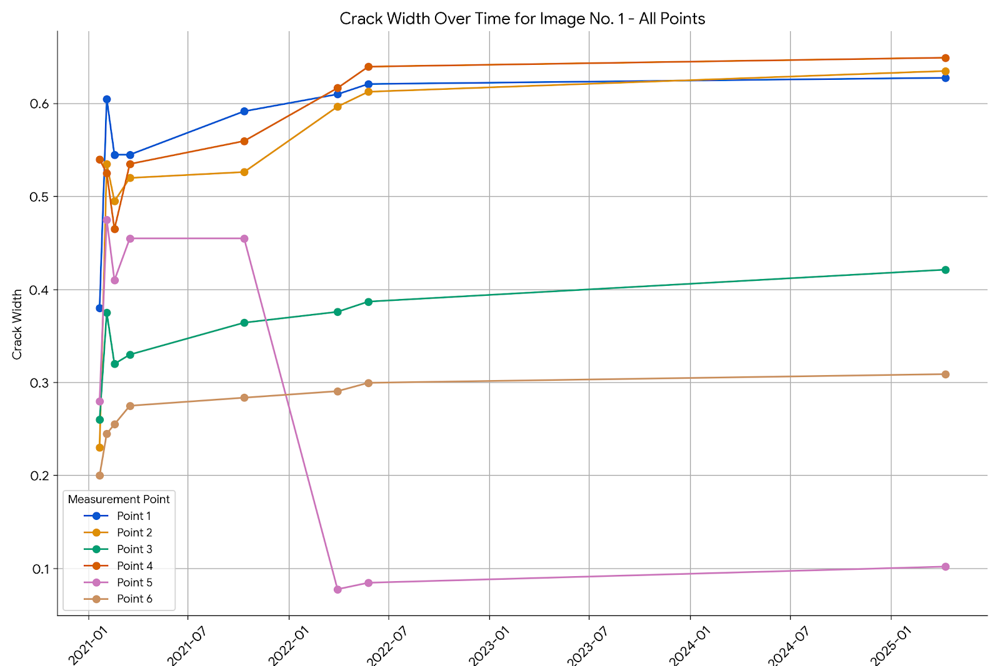

# Building Crack Forecasting with Prophet

This repository provides a Google Colab notebook for forecasting building crack data using Facebook Prophet. The project involves raw data preprocessing, feature selection, and applying the Prophet model to predict future crack trends.

## Table of Contents

* [Introduction](#introduction)
* [Files in this Repository](#files-in-this-repository)
* [Model Used: Facebook Prophet](#model-used-facebook-prophet)
* [Data Preprocessing and Feature Selection](#data-preprocessing-and-feature-selection)
* [How to Run](#how-to-run)
* [Results](#results) 
* [Dependencies](#dependencies)
* [Contributing](#contributing)
* [License](#license)

## Introduction

Monitoring and predicting building crack propagation is critical for structural integrity assessment, maintenance planning, and ensuring public safety. This project utilizes the powerful **Facebook Prophet** library to develop a robust forecasting model for building crack data. We begin with raw building crack summary data, meticulously preprocess it, perform essential feature selection, and then feed this cleaned data into Prophet to generate future predictions. The entire workflow is encapsulated within a Google Colab notebook, ensuring ease of access, execution, and reproducibility for anyone interested in structural health monitoring or time series forecasting.

## Files in this Repository

* `Prophet_for_forecasting_of_all_images.ipynb`: This is a Google Colab notebook containing the Python code for:
    * Loading the raw building crack data.
    * Performing data preprocessing and feature selection.
    * Training the Facebook Prophet model.
    * Generating future forecasts.
    * Visualizing the historical data, forecasts, and model components.
* `Building-crack_SUMMARY_2025-;2017.xlsx - Summary.csv`: This CSV file contains the raw, historical building crack summary data, likely spanning from 2017 up to 2025 (or intended to be). This is the initial dataset that undergoes preprocessing.
* `New data of 2021.xlsx - Sheet1.csv`: This CSV file represents the preprocessed and feature-selected dataset, derived from `Building-crack_SUMMARY_2025-;2017.xlsx - Summary.csv`. This clean and prepared data is directly used as input for the Prophet forecasting model.

## Model Used: Facebook Prophet

**Facebook Prophet** is a forecasting procedure developed by Facebook's Core Data Science team. It is specifically designed to handle time series data that exhibit strong seasonal effects, holiday impacts, and missing data, which are common characteristics of many real-world business and operational time series. Its key advantages include:

* **Robustness to missing data and outliers**: Prophet can handle gaps in historical data and anomalies without significant degradation in performance.
* **Automatic handling of seasonality**: It can detect and model yearly, weekly, and daily seasonality.
* **Incorporation of holidays and special events**: You can provide a custom list of events that can impact your time series, and Prophet will account for them.
* **Flexible and interpretable models**: Prophet's components (trend, seasonality, and holidays) are easily interpretable, allowing for better understanding of the underlying patterns.
* **Scalability**: It's designed for automated forecasting and works well on large datasets.

Prophet works by decomposing the time series into a trend component, a seasonal component, and a holiday component, fitting them using a generalized additive model (GAM).

## Data Preprocessing and Feature Selection

The raw `Building-crack_SUMMARY_2025-;2017.xlsx - Summary.csv` undergoes a comprehensive preprocessing pipeline within the `Prophet_for_forecasting_of_all_images.ipynb` notebook. This typically involves:

* **Loading and Inspection**: Reading the data and understanding its structure.
* **Date/Time Handling**: Ensuring date columns are correctly parsed and set as the index if needed, as Prophet requires a 'ds' (datestamp) column.
* **Data Cleaning**: Addressing missing values (e.g., imputation or removal), correcting data types, and handling any inconsistencies.
* **Feature Engineering**: Potentially creating new features (e.g., lagged variables, rolling averages, or indicators for specific events) that could enhance the forecasting accuracy.
* **Feature Selection**: Identifying and retaining only the most relevant columns for forecasting. For Prophet, this typically means the time series column and any relevant regressors. The preprocessed output is saved as `New data of 2021.xlsx - Sheet1.csv`, ready for model consumption.

## How to Run

1.  **Open in Google Colab**: Click the "Open in Colab" badge below (if implemented on your GitHub repo) or manually open the `Prophet_for_forecasting_of_all_images.ipynb` notebook in Google Colab by navigating to `File > Open notebook > GitHub` and entering the URL of this repository.

    [](https://colab.research.google.com/drive/1mSRJyJnbKns2Xmze9zDVc1usW-sGJXBl?usp=sharing)

3.  **Upload Data**: The notebook is designed to run in Google Colab. You will need to ensure that `Building-crack_SUMMARY_2025-;2017.xlsx - Summary.csv` (if you want to re-run the preprocessing) and `New data of 2021.xlsx - Sheet1.csv` are uploaded to your Colab environment or mounted from Google Drive as instructed in the notebook.

4.  **Execute Cells**: Run all the cells in the notebook sequentially (`Runtime > Run all`). The notebook will guide you through the entire process, from data loading to model training, forecasting, and visualization of the results directly within the notebook.

## Results

After running the `Prophet_for_forecasting_of_all_images.ipynb` notebook, the model will generate forecasts for building crack progression. The visualizations within the notebook will display the historical data, the model's fit, and the predicted future trends, along with confidence intervals.

Below is an example of a generated forecast plot, illustrating the historical crack data and the projected future values:




These results provide valuable insights for proactive maintenance and structural monitoring.

## Dependencies

The Google Colab environment typically comes with most of the necessary libraries pre-installed. However, if you're running this code locally, ensure you have the following Python libraries installed:

* `pandas`
* `numpy`
* `matplotlib`
* `seaborn`
* `scikit-learn` (for data splitting, if used)
* `prophet` (from `fbprophet`)

You can install them using pip:

```bash
pip install pandas numpy matplotlib seaborn scikit-learn prophet
